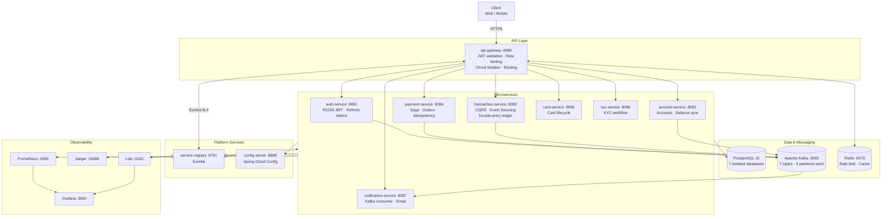

# FluxBank

[](https://github.com/Mirsmog/flux-bank/actions/workflows/ci-cd.yml)


Banking backend built as a microservices system. RS256 JWT auth, CQRS + Event Sourcing, Saga + Outbox, full observability, Kubernetes deployment with Helm.

---

## Architecture



---

## Services

| Service | Port | Responsibility | Key Patterns |
|---|---|---|---|
| api-gateway | 8080 | Single ingress — JWT validation, routing, rate limiting | Resilience4j, Redis token bucket |
| service-registry | 8761 | Service discovery | Netflix Eureka |
| config-server | 8888 | Centralized configuration | Spring Cloud Config native |
| auth-service | 8081 | Authentication, token issuance | RS256 JWT, refresh tokens, Kafka events |
| account-service | 8082 | Account lifecycle, balance management | Feign, optimistic delta updates |
| transaction-service | 8083 | Immutable ledger, transaction history | CQRS, Event Sourcing, double-entry |
| payment-service | 8084 | Payment orchestration | Saga, Transactional Outbox, idempotency |
| card-service | 8085 | Card issuance and status | JPA state machine |
| kyc-service | 8086 | KYC onboarding and verification | Kafka events |
| notification-service | 8087 | Event-driven email notifications | Kafka consumer |

---

## Tech Stack

| | |
|---|---|
| **Runtime** | Java 21, Spring Boot 3.3.5, Spring Cloud 2023.0.3 |
| **Gateway** | Spring Cloud Gateway (WebFlux), Resilience4j |
| **Messaging** | Apache Kafka 3.7, Spring Kafka |
| **Databases** | PostgreSQL 16 (per-service), Flyway migrations, HikariCP |
| **Cache** | Redis 7.2 |
| **Security** | Spring Security, JJWT 0.12.6, RSA-2048 / RS256 |
| **Observability** | Micrometer, OpenTelemetry 1.41, Prometheus, Grafana, Jaeger, Loki |
| **Build** | Maven 3.9, multi-module, Docker multi-stage (Alpine) |
| **Deploy** | Kubernetes, Helm 3.12, GitHub Actions, GHCR |

---

## Design Patterns

<details>
<summary><strong>CQRS + Event Sourcing</strong> — transaction-service</summary>

Transactions are stored as immutable events. The ledger is never updated — only appended to.

```
DEPOSIT / WITHDRAWAL / TRANSFER_DEBIT / TRANSFER_CREDIT / FEE / REVERSAL
     │
     ▼
transaction_events (append-only)
     │
     ▼
ledger_entries (double-entry projections)
```

- `balance_after` snapshot on each event avoids full replay for balance queries
- Correlation ID links both legs of a P2P transfer

</details>

<details>
<summary><strong>Saga + Transactional Outbox</strong> — payment-service</summary>

```
INITIATED → VALIDATING → DEBITED → CREDITED → COMPLETED
                │                                  ▲
                └──────────── FAILED ──────────────┘
                                 │
                    COMPENSATION_PENDING → COMPENSATED
```

The Outbox pattern guarantees event delivery even if Kafka is temporarily down:

1. Payment record + outbox event written in a single DB transaction
2. `OutboxPublisher` polls every 5 s for unpublished events
3. On successful Kafka send → marks event `published = true`

</details>

<details>
<summary><strong>Idempotency</strong> — payment-service</summary>

`X-Idempotency-Key` header required on all payment requests. A `UNIQUE` constraint on the `idempotency_key` column at the DB level prevents duplicate processing. Safe to retry without side effects.

</details>

<details>
<summary><strong>Rate Limiting</strong> — api-gateway</summary>

Redis-backed token bucket (Spring Cloud Gateway `RequestRateLimiter`):

- **20 tokens/s** replenish rate, **50-token** burst capacity
- Key: `user:<userId>` for authenticated requests, `ip:<client-ip>` as fallback

</details>

---

## Quick Start

**Prerequisites:** Java 21+, Maven 3.9+, Docker Compose v2

### 1. Start infrastructure

```bash
cd infrastructure
docker compose up -d
# wait ~30s for health checks
docker compose ps
```

### 2. Build

```bash
mvn clean install -DskipTests
```

### 3. Run services (start in this order)

```bash
# 1 — service-registry
cd service-registry && mvn spring-boot:run

# 2 — config-server
cd config-server && mvn spring-boot:run

# 3 — api-gateway + any microservice
cd api-gateway && mvn spring-boot:run
cd auth-service && mvn spring-boot:run
```

### 4. Verify

| URL | |
|---|---|
| http://localhost:8761 | Eureka dashboard |
| http://localhost:8888/actuator/health | Config server health |
| http://localhost:8080/actuator/health | Gateway health |
| http://localhost:8090 | Kafka UI |

---

## Observability

| Tool | URL | What's there |
|---|---|---|
| Grafana | http://localhost:3000 | JVM metrics, HTTP rates, Kafka lag |
| Jaeger | http://localhost:16686 | Distributed traces across all services |
| Prometheus | http://localhost:9090 | Raw metrics scrape |
| Loki (via Grafana) | http://localhost:3000 | Structured JSON logs |

All services export traces via OTLP (gRPC `:4317` / HTTP `:4318`) and metrics at `/actuator/prometheus`.

---

## Deployment

### Kubernetes + Helm

```bash
# Staging
helm upgrade --install fluxbank ./helm/fluxbank \
  -f ./helm/fluxbank/values-staging.yaml \
  -n fluxbank-staging --create-namespace \
  --set image.tag=sha-<commit>

# Production
helm upgrade --install fluxbank ./helm/fluxbank \
  -f ./helm/fluxbank/values-production.yaml \
  -n fluxbank-production --create-namespace \
  --set image.tag=sha-<commit>
```

**Required secrets before deploy:**

```bash
kubectl create secret generic fluxbank-jwt-keys \
  --from-file=private_key.pem \
  --from-file=public_key.pem \
  -n fluxbank-staging

kubectl create secret generic fluxbank-db-credentials \
  --from-literal=password=<db-password> \
  -n fluxbank-staging
```

**Production HPA targets:**

| Service | Min | Max | CPU |
|---|---|---|---|
| api-gateway | 3 | 10 | 70% |
| auth-service | 2 | 6 | 70% |
| account-service | 3 | 8 | 70% |
| payment-service | 2 | 6 | 70% |

---

## CI/CD

GitHub Actions pipeline (`.github/workflows/ci-cd.yml`):

```
push to main / develop
       │
       ▼
 ┌─────────────────────────────────┐
 │  test (parallel, all services)  │  mvn test -pl <service> -am
 └───────────────┬─────────────────┘
                 │ on push only
       ▼
 ┌─────────────────────────────────┐
 │  build & push (parallel)        │  Docker Buildx → GHCR
 └───────────────┬─────────────────┘
                 │ main only
       ▼
 ┌──────────────┐    ┌──────────────────┐
 │   staging    │ →  │   production     │
 │  (auto)      │    │  (after staging) │
 └──────────────┘    └──────────────────┘
```

Images are tagged `latest` (main), `sha-<commit>`, and `<branch>`.

---

## Environment Variables

Defaults are safe for local development. Override via `.env` at repo root.

| Variable | Default | Used by |
|---|---|---|
| `POSTGRES_PASSWORD` | `fluxbank_pass` | All Postgres instances |
| `REDIS_PASSWORD` | `fluxbank_redis` | Redis, api-gateway |
| `EUREKA_URL` | `http://localhost:8761/eureka/` | All services |
| `CONFIG_SERVER_URL` | `http://localhost:8888` | All services |

---

## Project Layout

```
flux-bank/
├── common-lib/            # Shared DTOs, events, exceptions, Kafka constants
├── config-server/         # Centralized config (src/main/resources/config/)
├── service-registry/      # Eureka server
├── api-gateway/           # Gateway, rate limiting, circuit breakers
├── auth-service/          # JWT issuance, RS256 keys
├── account-service/
├── transaction-service/   # CQRS + Event Sourcing
├── payment-service/       # Saga + Outbox + Idempotency
├── card-service/
├── kyc-service/
├── notification-service/
├── infrastructure/
│   └── docker-compose.yml
├── helm/fluxbank/         # Umbrella Helm chart + per-service subcharts
├── k8s/                   # Raw Kubernetes manifests
└── pom.xml                # Multi-module root POM
```

---

## Contributing

1. Branch from `main` → `feature/<short-description>`
2. `mvn verify` must pass locally
3. Open a PR — CI must be green before merge
